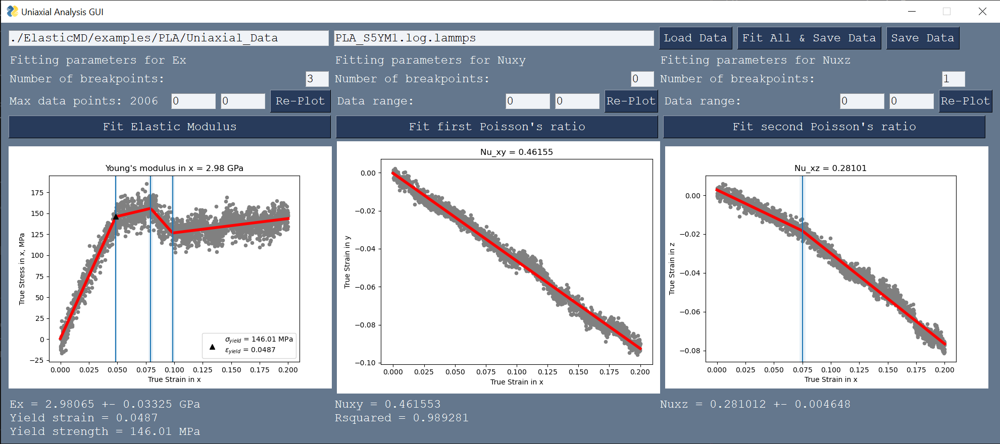
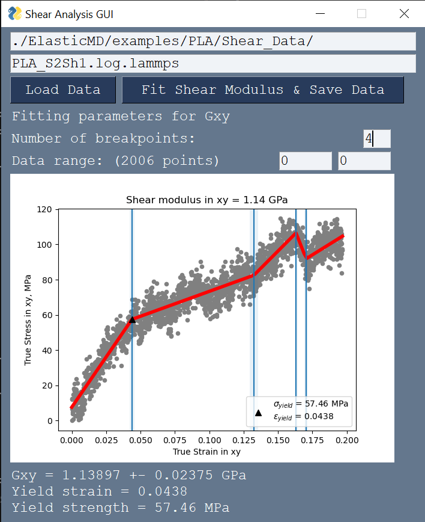

# ElasticMD
ElasticMD is a Python package for computing elastic moduli from stress-strain data generated from a LAMMPS simulation. The main feature of this software is the two GUIs for computing Young's modulus and Poisson's ratios, and shear modulus. Please see the [wiki](https://github.com/wapisani/ElasticMD/wiki) for tutorials.

Below are screenshots of the two GUIs. The first image is the uniaxial analysis GUI and the second image is the shear analysis GUI.

# Requirements
* Python 3.7+ (tested on Python 3.11.5)
* piecewise-regression 1.1.2+ - [Github](https://github.com/chasmani/piecewise-regression), [conda-forge](https://anaconda.org/conda-forge/piecewise-regression)
* matplotlib 3.7.2+
* scikit-learn 1.3.0+
* numpy 1.24.3+
* PySimpleGUI 4.60.5+ 

I recommend [Anaconda Python 3.11](https://www.anaconda.com/download#downloads) for desktop systems. ElasticMD installation instructions are [here](https://github.com/wapisani/ElasticMD/wiki/Installation).

# License
All code in this repository, unless otherwise noted, is licensed under the GNU General Public License v3.0. 

# To Do:
* Make a PySimpleGUI for bulk modulus
